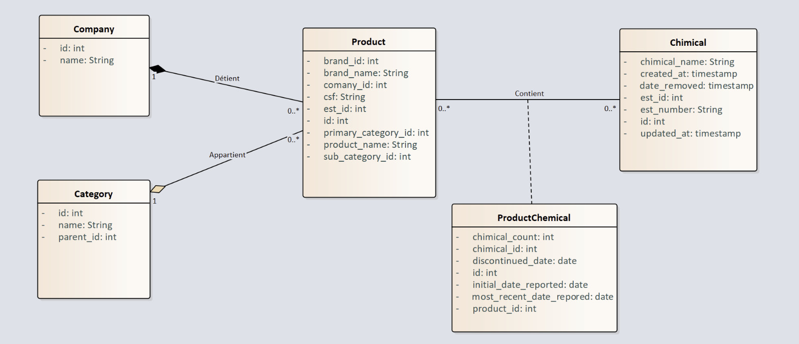
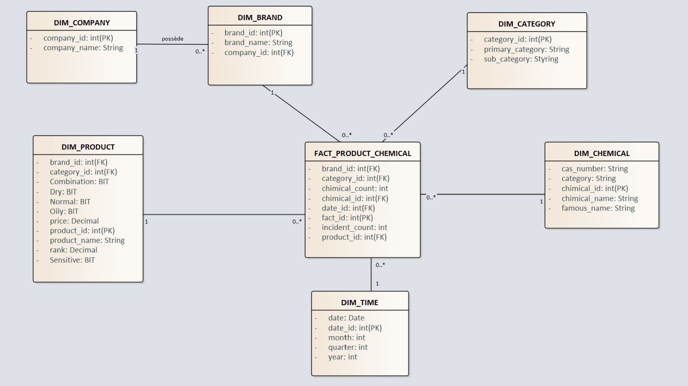
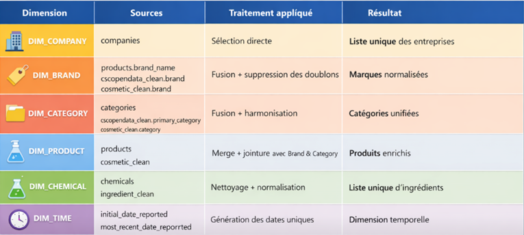

# Cosmeto Intelligent Data Pipeline / CosmetoDataForge

## Vue d'ensemble
Le projet Cosmeto Intelligent Data Pipeline (CosmetoDataForge) vise à rationaliser le processus de manipulation des données, permettant des analyses efficaces et une prise de décision éclairée dans le secteur cosmétique. Ce système intelligent traite des volumes de données variés provenant de différentes sources, offrant des solutions adaptées aux besoins des utilisateurs.

## Caractéristiques clés
- Intégration de multiples sources de données
- Traitement en temps réel des informations
- Analyse approfondie des données pour des insights personnalisés
- Interface utilisateur conviviale pour la gestion des données

## Architecture

## Mise en route
Pour démarrer avec le projet CosmetoDataForge, suivez les étapes ci-dessous :
1. Clonez le dépôt depuis GitHub : [https://github.com/ahmed-elmahdaoui/cosmeto-intelligent-data-pipeline](https://github.com/ahmed-elmahdaoui/cosmeto-intelligent-data-pipeline)
2. Installez les dépendances requises.
3. Configurez les paramètres selon vos besoins. 

## Configuration
Modifiez le fichier de configuration pour y inclure vos informations de connexion et autres paramètres spécifiques à votre environnement.

## Utilisation
Pour utiliser le pipeline, exécutez les scripts fournis et finissez avec une analyse via l'interface utilisateur pour visualiser les résultats.

## Actifs du dépôt
Le dépôt contient également des ressources au format PDF/zip pour une compréhension plus approfondie du projet. Vous pouvez les trouver dans le répertoire des ressources.

## Contributeurs
- Ahmed El Mahdaoui ([@ahmed-elmahdaoui](https://github.com/ahmed-elmahdaoui))

## Licence
Ce projet est sous licence MIT - voir le fichier [LICENSE](LICENSE) pour plus de détails.

## Contact
Pour toute demande ou question, veuillez contacter : ahmed.elmahdaoui@example.com